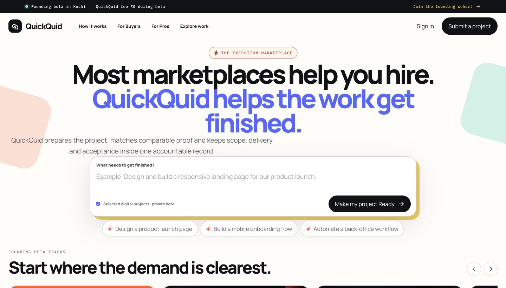

# QuickQuid — Final Interactive Prototype

> **Most marketplaces help you hire. QuickQuid helps the work get finished.**

QuickQuid is an execution marketplace for selected digital projects. This repository contains the final frontend prototype used to demonstrate the full visitor, Buyer, Pro, readiness, verification, delivery, payment-operations, support, and Admin journeys.

## Live prototype

- **GitHub Pages:** https://sabari-nath17.github.io/quickquid-final-prototype/
- **Engineering handoff:** [QuickQuid_Engineering_Handoff.pdf](public/docs/QuickQuid_Engineering_Handoff.pdf)
- **Engineering source of truth and AI guard rails:** [QUICKQUID_ENGINEERING_GUARDRAILS.md](QUICKQUID_ENGINEERING_GUARDRAILS.md)
- **Design and interaction QA:** [design-qa.md](design-qa.md)



## What is implemented

- Colorful, responsive public landing page with prompt persistence, beta-track carousel, five-stage execution workflow, Buyer/Pro CTAs, and truth-based founding-beta copy.
- Landing prompt → Project Readiness → authentication/onboarding handoff using the existing guest readiness draft.
- Role-aware in-app navigation history and accessible Back controls across visitor, Buyer, Pro, readiness, support, and Admin surfaces.
- Buyer workflows for profiles, talent discovery, briefs, contracts, milestone payments, delivery, messages, reviews, and support.
- Pro workflows for profiles, skill evidence, briefs, proposals, contracts, gigs, payout readiness, delivery, and reviews. Seeded prototype Pros open directly into their dashboards and public profiles include live public GitHub profile/repository metadata plus provider-shaped LinkedIn, Behance, and portfolio sync previews. Every seeded Pro includes a complete profile fixture, public-proof links, portfolio references, and reviewable skill evidence; provider links marked `Demo fixture` are synthetic and must be replaced before production.
- Pro onboarding captures the selected category, every selected skill's evidence, public GitHub/LinkedIn/portfolio proof links, and a review snapshot for Admin. Public Pro profiles can show safe links and read-only public GitHub repository metadata when the provider API responds.
- Admin operations for KYC, client enrollment, per-skill verification, payments, payouts, refunds, disputes, Trust & Safety, moderation, and audit trails.
- QuickQuid Verified state for approved clients and for Pros with approved identity plus at least one Admin-approved skill. The badge tooltip reads `QuickQuid Verified`.
- Dirty-form navigation guards and safe role-specific Back fallbacks.

## Truth and prototype boundaries

- Founding beta is positioned for Kochi and selected digital projects.
- The QuickQuid platform fee is temporarily ₹0 during beta. Payment-provider charges and taxes may still apply.
- No live-job counters, customer testimonials, ratings claims, artificial deadlines, or fake marketplace activity are presented on the landing page.
- Data is realistic seeded prototype data stored locally in the browser. No production backend, payment, identity-provider, or database integration is included in this repository.

## Demo access

Select **Sign in** on the landing page to choose a role. One-click prototype accounts cover:

- Buyers: Northstar Labs, Verdant Retail
- Pros: Akhil Menon, Priya Nair, Rahul Verma, Sara Khan
- Admin: Support T1, Finance T2, Risk T3, Ops Manager

Creating a new Buyer or Pro account now creates an unverified local prototype account. A new Pro must complete category, skills, public proof, per-skill evidence, identity, and payout onboarding before paid-work surfaces or gig publishing unlock. Verification must be approved by the appropriate Admin flow.

## Local development

Requirements: Node.js 20+ and npm.

```bash
npm install
npm run dev
```

Open `http://localhost:3000`.

Production build:

```bash
npm run lint
npm run build
PORT=3001 node .next/standalone/server.js
```

## Verification status

- ESLint: passing
- Next.js production build: passing
- Static GitHub Pages export: verified in CI
- TypeScript application code: passing; the repository's optional WebSocket examples still reference uninstalled `socket.io` and `socket.io-client` packages
- Responsive QA: 1440 × 822 and 390 × 844, no horizontal overflow
- Browser smoke tests: visitor, Buyer, Pro, Admin, navigation history, readiness, and verification-to-badge transition

## Repository map

- `src/components/qq/screens/visitor` — landing, auth, guest readiness, readiness summary
- `src/components/qq/screens/buyer` — Buyer product workflows
- `src/components/qq/screens/pro` — Pro product workflows
- `src/components/qq/screens/admin` — Admin and verification operations
- `src/lib/qq` — prototype domain types, seed data, and Zustand store
- `public/assets` — approved QuickQuid landing assets
- `public/docs` — engineering handoff PDF
- `audit-final` — current-run browser QA evidence

## Handoff note

This is a frontend-only, private-beta product prototype. Before production, replace seeded local state with authenticated backend services, a compliant identity/KYC vendor, controlled media storage, server-side GitHub/LinkedIn adapters, production payment-provider integrations, observability, and role-enforced server authorization. AI assistants must follow [QUICKQUID_ENGINEERING_GUARDRAILS.md](QUICKQUID_ENGINEERING_GUARDRAILS.md); they may summarize or route evidence, but may not make identity, skill, payment, dispute, or moderation decisions.
